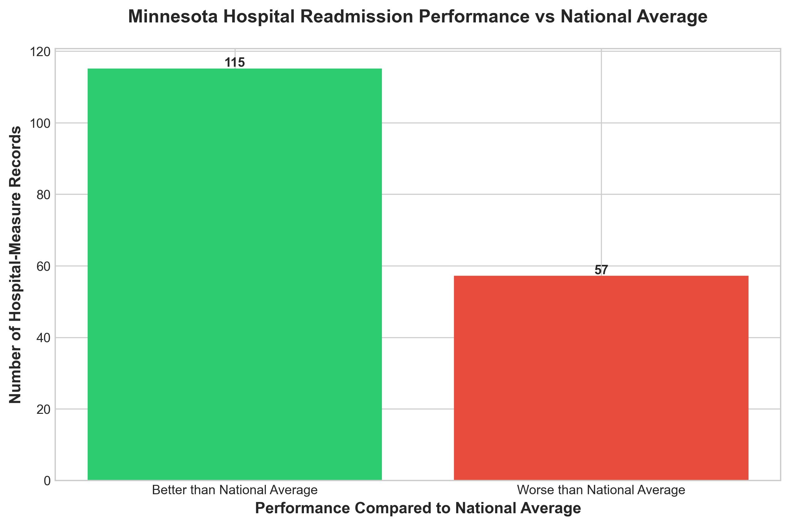
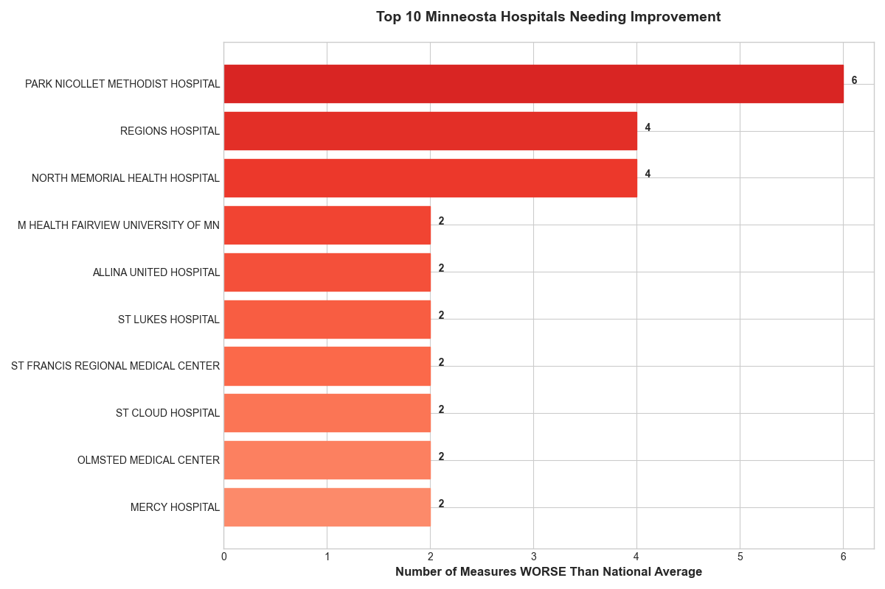
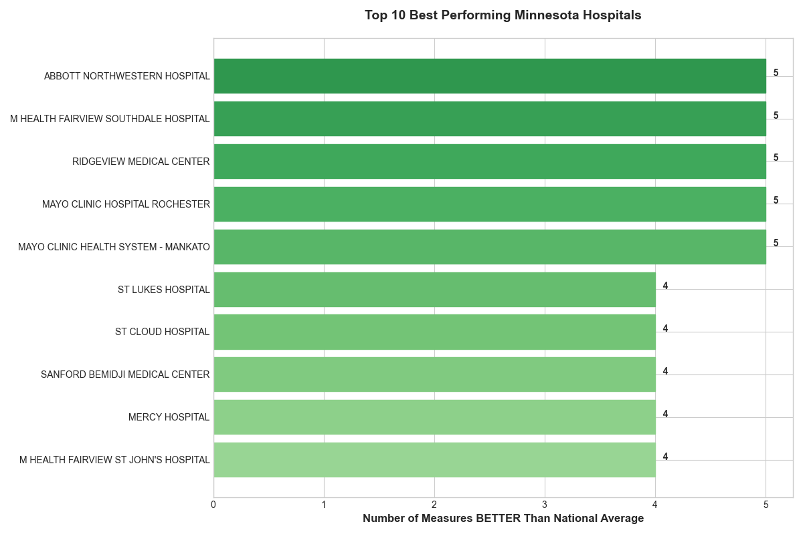

# Minnesota Hospital Readmission Analysis
## Real Medicare Data Analysis Project

---

Project Overview

**Objective:** Analyze Medicare hospital readmission data for Minnesota to identify quality improvement opportunities and healthcare cost reduction strategies.

**Data Source:** Centers for Medicare & Medicaid Services (CMS) Hospital Readmission Reduction Program  
**Data Type:** 100% real government data  
**Scope:** Minnesota hospitals across multiple readmission measures

---

## Business Problem

Hospital readmissions within 30 days are:
- Costly for healthcare systems
- Often preventable with proper care
- Subject to Medicare penalties for poor performance
- A key quality indicator

**Goal:** Identify which Minnesota hospitals and conditions need targeted interventions to reduce readmissions and improve patient outcomes.

---

## Data Analysis

### Data Source
- **Source:** CMS Hospital Readmission Reduction Program (data.cms.gov)
- **Records Analyzed:** 276 Minnesota hospital-measure combinations
- **Hospitals Covered:** 46 unique Minnesota facilities
- **Measures:** Heart Failure, Pneumonia, COPD, Heart Attack, Stroke, Hip/Knee Replacement

### Methodology
1. **Data Collection:** Downloaded real Medicare hospital readmission data
2. **Data Cleaning:** Filtered to Minnesota hospitals, removed unavailable data
3. **Performance Analysis:** Compared hospitals to national benchmarks
4. **Condition Analysis:** Identified which medical conditions have most issues
5. **Hospital Ranking:** Ranked facilities by performance

---

## Key Findings

### Overall Performance
- **33.1%** of Minnesota hospital-measures perform worse than national average
- **66.9%** perform better than national average

### Problem Areas
- **Top Issue:** PNEUMONIA has most hospitals performing below average
- **Hospitals Needing Improvement:** 15 facilities have multiple worse-than-average measures

### Best Performers
- **Top Hospital:** ABBOTT NORTHWESTERN HOSPITAL excels in ALL 6 measures
- **Best Practices:** Top performers can be studied for quality improvement strategies

---

## Recommendations

### Immediate Actions
1. **Focus on PNEUMONIA** - Has highest number of underperforming hospitals
2. **Target 10 specific hospitals** - Facilities with multiple poor measures need intervention
3. **Study best practices** - Learn from top-performing Minnesota facilities

### Strategic Initiatives
1. Implement condition-specific quality improvement programs
2. Establish peer learning network among Minnesota hospitals
3. Create standardized discharge protocols based on best performers
4. Monitor progress with quarterly readmission rate reviews

---

## Technical Details

### Tools Used
- **Python 3.x**
- **pandas:** Data manipulation and analysis
- **matplotlib & seaborn:** Data visualization
- **NumPy:** Numerical operations

### Files in This Project
```
healthcare_project/
├── charts                                       # Charts folder where all charts live
├────── performance_distribution.png             # Comparison of better to worse measures
├────── performance_by_measures.png              # Chart for how each measure performs across all hosptials
├────── hospitals_needing_improvement.png        # 10 worst hospitals needing improvement
├────── top_performing_hospitals.png             # Top 10 best performing hospitals
├── data                                         # Data folder where all data files live
├────── hospital_readmissions.csv                # Original Medicare data
├────── minnesota_hospitals.csv                  # Minnesota subset
├────── hospitals_needing_improvement.csv        # Analysis results for hospitals needing improvement
├────── top_performing_hospitals.csv             # Best performers
├── data_exploration.py                          # Initial data exploration
├── analyze_minnesota_hospitals.py               # Main analysis script
├── visualizations.py                            # Chart generation
└── README.md                                    # This file
```

### How to Run This Analysis
```bash
# 1. Install required packages
pip install pandas matplotlib seaborn numpy

# 2. Run analysis scripts in order
python data_exploration.py
python analyze_minnesota_hospitals.py
python visualizations.py
```

---

## Sample Visualizations

### Performance Distribution


### Performance by Condition


### Hospitals Needing Improvement


### Top Performers


---

## Insights & Learnings

### What I Learned
- How to work with real government healthcare data
- Medicare quality measurement programs
- Healthcare analytics and quality metrics
- Data cleaning and preparation techniques
- Communicating data insights to stakeholders

### Challenges Overcome
- Understanding complex Medicare data structure
- Handling missing/unavailable data points
- Creating meaningful comparisons across different measures
- Presenting technical findings in business-friendly format

---

## Skills Demonstrated

- Real-world data analysis with government healthcare data  
- Data cleaning and quality assessment  
- Comparative performance analysis  
- Statistical aggregation and summarization  
- Professional data visualization  
- Business recommendation development  
- Healthcare domain knowledge  
- Python programming (pandas, matplotlib, seaborn)  

---

## About This Project

This project was created as a portfolio demonstration of data analysis skills applied to healthcare quality improvement. It uses 100% real Medicare data to analyze Minnesota hospital readmission performance.

**Created:** March 2, 2026  
**Data Source:** Centers for Medicare & Medicaid Services  
**Focus:** Minnesota Healthcare Analytics

---

## References

- [CMS Hospital Readmission Reduction Program](https://www.cms.gov/medicare/payment/prospective-payment-systems/acute-inpatient-pps/hospital-readmissions-reduction-program-hrrp)
- [Hospital Compare Data](https://data.cms.gov/provider-data/)
- [Medicare Payment Policy](https://www.medpac.gov/)

---

**Note:** This analysis uses publicly available Medicare data. All findings are based on official government quality measures and national benchmarks.